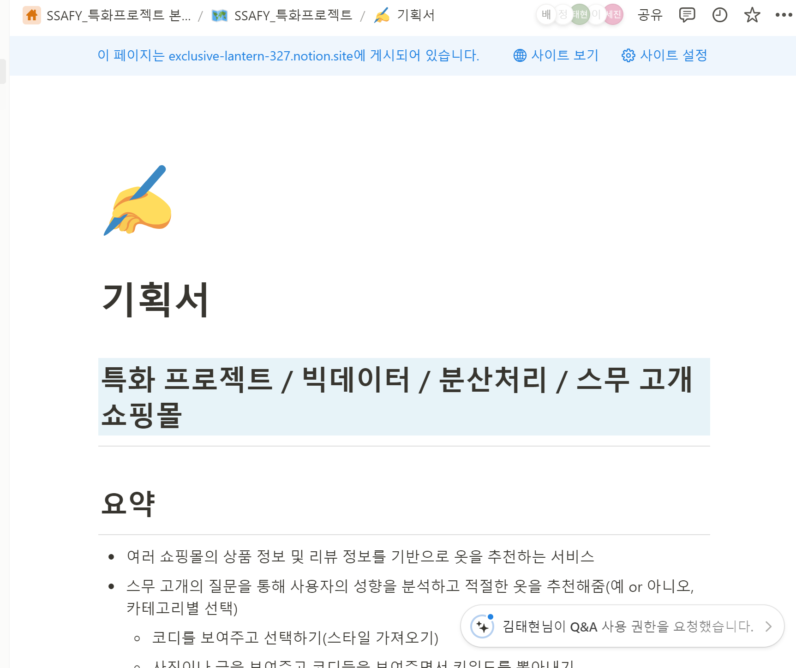

## 2주차

### 2024-02-26 월요일

프로젝트 기획
- 아이디어 회의
- 아이디어 확정 및 구체화
- Golden Circle에 맞게 요구사항 분석 후 프로젝트 기능 구체화
- 아이디어 회의에서 나온 4개의 아이디어 중 쇼핑몰 주제로 선정
- 사용자 데이터 및 타 쇼핑몰 리뷰데이터 분석을 통한 사용자 맞춤 상품 추천 쇼핑몰을 주제로 프로젝트 주제 선정
- Notion을 통해 아이디어 회의 진행

