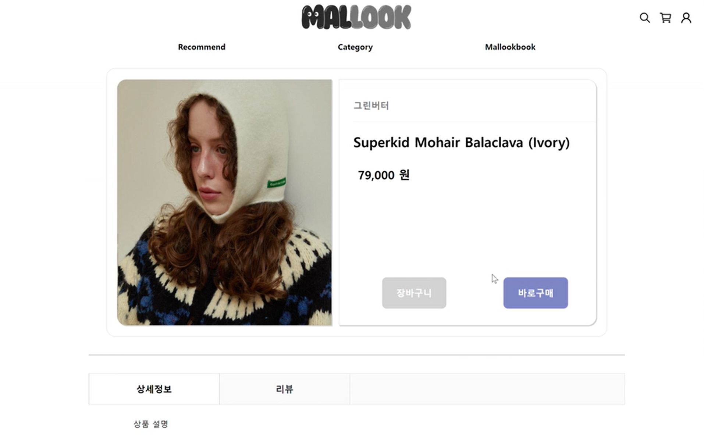
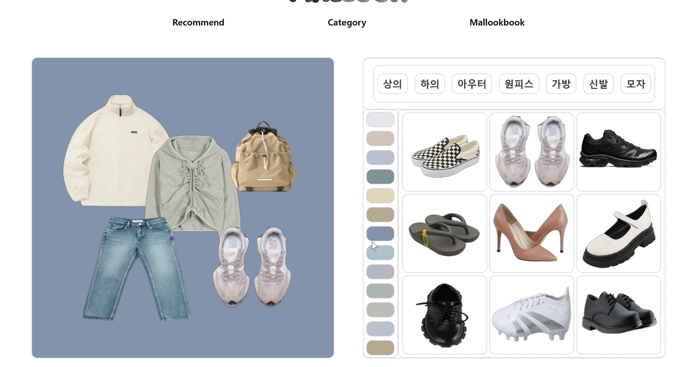
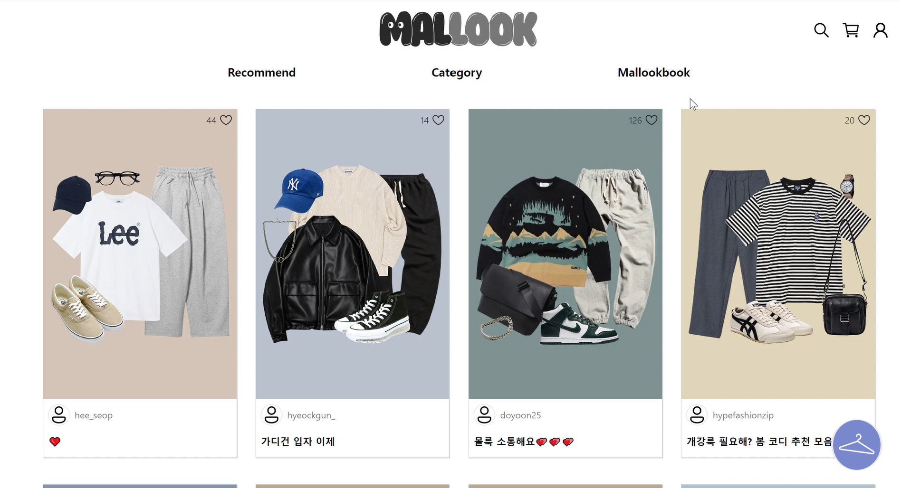
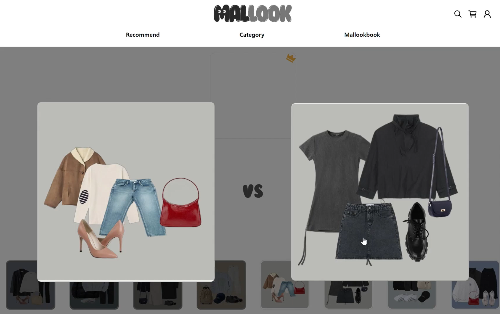
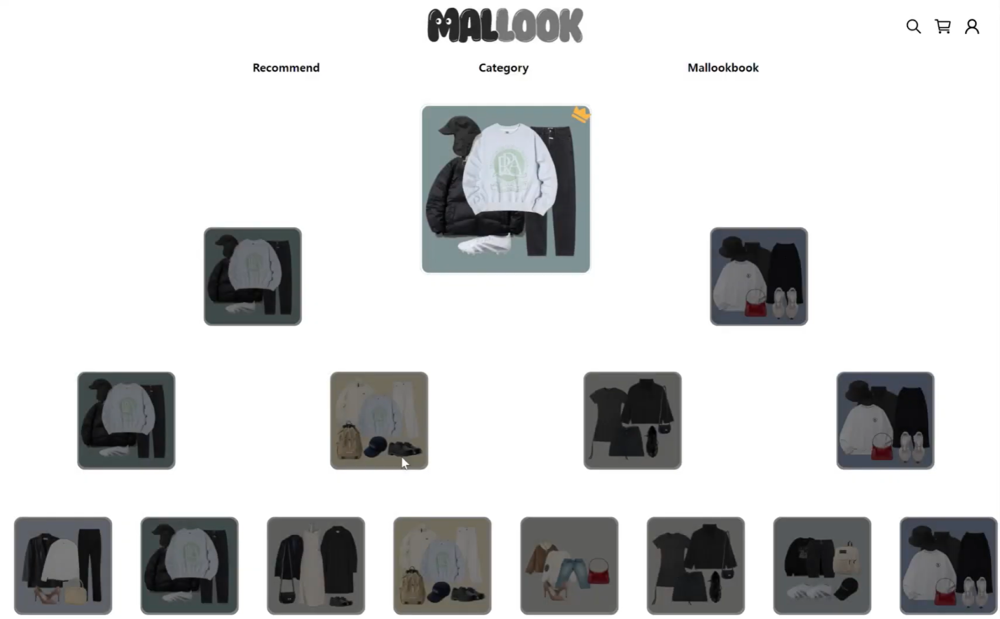

# 목차

1. [서비스 소개](#서비스-소개)
2. [기획 배경](#기획-배경)
3. [기술 스택](#기술-스택)
4. [화면소개](#-화면-소개)
5. [기술 스택](#-기술-스택)
6. [서비스 아키텍처](#-서비스-아키텍처)
7. [프로젝트 산출물](#-프로젝트-산출물)

---

# 👢서비스 소개

## 서비스 설명

### 개요

- **패션 월드컵**과 **스크립트**로 맞춤 옷을 추천받는 쇼핑몰 서비스
- 서비스 명 : **Mallook(몰룩)**

### 타겟 🎯

- 자신이 원하는 패션 성향을 찾기 어려워하는 사람
- 옷에 대한 정보를 한눈에 보고 싶은 사람
- 옷을 사기 전 코디를 해보고 싶은 사람

---
## UCC 🎞️

---
# 👕기획 배경

## 배경

오랜만의 쇼핑, 어떤 옷을 사야할지, 내가 어떤 스타일을 좋아하는지 잘 모르겠죠?

옷을 구매하러 쇼핑 어플을 실행해 봅시다. 많은 추천 상품들이 있죠. 그런데 그게 진정 나를 위한 상품들이던가요? 내가 원하는 스타일의 상품들이던가요?

코디를 하는 것이 어려운 당신, 오랜만의 쇼핑에 어떤 옷을 사야 할지, 내가 어떤 스타일을 좋아하는지에 대한 고민이 끝나지 않습니다.

그런 ‘패알못’ 사용자들의 쇼핑을 더 쉽고 즐겁게 하기 위해 MALLOOK이 등장했습니다!

내가 어떤 옷을 좋아하는지, 어떤 조합을 좋아하는지, 눈으로 직접 Look 해보세요.

## 목적 🥅

**내가 원하는 스타일을 쉽게 찾고, 미리 코디해서 후회없는 쇼핑을 하자!**

## 의의

- 키워드 기반 추천 서비스
- 패션 월드컵을 통해 선호 키워드 추출 및 스크립트 생성
- 구매 전 코디 매칭을 해볼 수 있는 코디북 서비스

---
# ***💻*** 기술 스택

### FrontEnd

### BackEnd

### Data

### Infra

### Tool

### Cooperation

---
# ***👖*** 화면 소개

### Mobile

#### 로그인 화면

- 카카오 로그인으로 로그인과 가입

#### 메인 화면

- 로그인 후 메인 화면

### 인기 순

- 리뷰 기준 인기 상품 추천

#### 카테고리 검색

- 카테고리 선택으로 상품 필터링
- 메인/서브 카테고리 선택으로 해당하는 상품만 조회

#### 구매

- 상품 수량과 사이즈를 선택해 주문

#### 몰룩북 메인

- 외곽선을 제거한 상품 이미지를 조합해 내가 구매할 옷을 미리 조합

#### 몰룩북 상세

- 조합한 코디에 포함한 키워드를 통해 상품 추천

#### 패션 월드컵

- 코디 이미지를 기반으로 월드컵을 진행
- 제일 선호하는 코디의 키워드를 통해 생성형 AI를 통해 문장 생성

#### 내 스크립트

- AI를 통해 생성한 문장으로 내가 선호하는 옷 스타일을 시각화

#### 내 스크립트 상세

- 스크립트를 생성할 때 사용했던 키워드를 통해 유사 상품 추천

#### 키워드 검색

- 핫한 키워드 목록을 확인
- 키워드 선택 및 검색어로 검색 가능

### Web

#### 메인 화면

#### 스크립트 추천

#### 스크립트 상품 리스트 페이지

#### 상품 상세 페이지

#### 몰룩북 생성 페이지

#### 몰룩북 커뮤니티 페이지

#### 월드컵 몰룩북 선택 페이지

#### 월드컵 결과 페이지

---
# 👗 기술 스택

## 1. Redis

> Redis는 주로 애플리케이션 캐시나 빠른 응답 속도를 가진 데이터베이스로 사용되는 오픈 소스 인메모리 NoSQL 저장소 입니다.
>

### 적용

- **JWT Token을 사용한 로그인**

  로그인 시 사용되는 Refresh-token을 저장하기 위해서 사용하였으며 보안성을 강화하기 위해서 엑세스 토큰 갱신 시에 리프레시 토큰도 같이 갱신되는 `Refresh Token Rotation` 방식을 채용하였습니다.

- **Spring Batch Scheduler Lock**

  여러 서버가 스케줄된 같은 시간에 Database에 접근해 Update 작업을 실행하면 데이터의 일관성과 무결성을 해칠 수 있기 때문에 `ShedLock` 라이브러리를 활용했습니다.

  한 서버에서 스케줄된 `Job` 이 실행되면 Redis에 해당 실행 정보를 넣어 작업 수행 최대 시간만큼 유지되게 하여 작업 수행 전 Redis에 정보가 있으면 `Job`을 수행하지 않게 하였습니다.

- 키워드 추천 및 Mallook북 월드컵 `Entity` 관리
  30분 간격으로 실시간 좋아요가 많은 Script의 pk를 가져와 Redis에서 관리하며 회원가입 시 키워드 추천에 활용했습니다.

  같은 시간 간격으로 좋아요가 많은 Style의 pk를 가져와 mallook북 월드컵에서 보여지는 코디로 활용했습니다.

  Redis 데이터 갱신을 빠른 주기로 하여, 신규 사용자가 편향된 Script와 Style을 통해 키워드 추천을 받는 것을 피하려 하였고, 빠른 데이터 처리를 지향했습니다.

## 2. Amazon S3

> AmazonS3는 주로 웹 서비스를 위한 온라인 파일 저장소로 사용되는 클라우드 스토리지 서비스입니다.
>
>
> Mallook은 S3를 통해 사용자가 생성한 몰룩북의 전체 이미지를 저장하고 관리합니다.
>

### 적용

- 상품의 외곽선을 자른 이미지를 조합해 사용자가 직접 만든 몰룩북의 사진을 저장, 관리합니다.

## 3. MongoDB

> MongoDB는 대용량 데이터를 처리할 때 우수한 성능을 발휘하는 NoSQL 데이터베이스입니다.
>
>
> Mallook은 여러 쇼핑몰들의 리뷰들을 MongoDB에 저장하여 키워드를 추출하고 관리합니다.
>

### 적용

- **추출한 상품 관리 및 저장**

  상품의 정보를 MongoDB로 저장하고 관리합니다. 해당 상품의 이미지, 브랜드 명, 리뷰, 리뷰에서 추출한 키워드까지 비정형된 대용량 데이터를 저장하고 관리합니다.

- **다양한 방식의 상품 조회**

  MongoDB로 관리하는 빅데이터의 다양한 필드 타입으로 다양한 조회 방식을 적용했습니다. 동적 쿼리를 활용해 메인 카테고리, 서브 카테고리 별 필터링 조회, 포함 검색을 통한 상품명 검색과 reviews Array를 활용해 리뷰가 많은 순 상품 추천까지 적용했습니다.

## 4. Hadoop

> 클러스터에서 동작하는 분산 응용 프로그램을 지원하는 빅데이터 솔루션 프레임워크입니다.
>

### 적용

- 정제화된 상품 리뷰를 HDFS에 저장한 후, 형태소 분석 과정에서 분산 처리를 합니다.
- 형태소 분석 결과, 명사인 것이 키워드로 사용하기 적절하다 판단했습니다. 이를 미리 선별한 키워드 데이터 세트와 비교하며 카운팅을 진행했습니다.
- 분산 처리하지 않았을 때와 비교했을 때 약 30.43%의 성능 개선 결과를 보였습니다. 데이터의 크기가 증가할수록 속도 개선율은 더 커질 것이라 판단됩니다.

## 5. Open AI ChatGPT

> OpenAI의 ChatGPT는 다양한 주제에 대해 즉각적인 답변, 창의적인 영감, 그리고 학습 기회를 제공하는 도구입니다.
>
>
> Mallook은 생성형 AI를 통해 사용자가 선택한 키워드를 바탕으로 재밌는 스크립트를 만들어내고 해당 스크립트를 기반으로 상품을 추천합니다.
>

### 적용

- Model

  GPT-3.5-turbo 모델의 스트리밍 방식 대화를 통해 지속적인 프롬프트 문구 추가로 Mallook의 스크립트 문장에 맞는 스크립트 생성을 유도했습니다. 상품 추천을 위한 키워드 저장을 문장으로 생성해 사용자가 선호하는 스타일을 한 문장으로 표현합니다.

---

# 🛍 서비스 아키텍처

- 사용자의 요청이 들어오는 `검정색` 라인에 대하여 `nginx`의 `reverse proxy`를 이용하여 라우팅
  - `/` 주소에 대해서 frontend page로 라우팅
  - `/api` 주소에 대해서 backend api 요청
- `주황색` 라인에 대해서 `gitlab-runner`를 이용하여 자동 배포를 위한 `cicd` 구축

---

# 👚 프로젝트 산출물

## 프로젝트 진행

## 1. Git flow

Git flow 사용을 위해 `sourcetree` 프로그램을 사용하였고 `git convention`을 지켜가며 프로젝트 개발에 임하였습니다.

## 프로젝트 산출물

### 1. Figma

### 2. ERD

### 3. API 문서

### 4. Gitlab 이슈 관리를 통한 기능 구현

